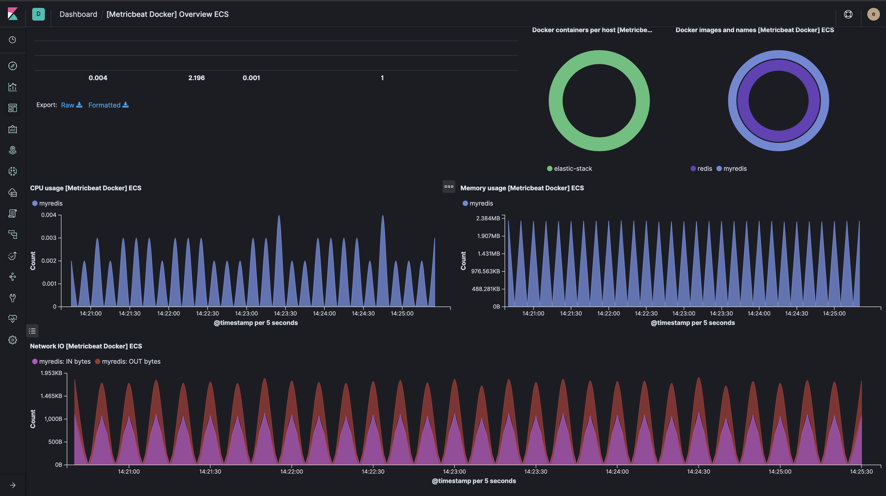

# Elastic Stack 5.2

This repository will install the [Elastic Stack](https://www.elastic.co/products) (Elasticsearch, Logstash, Kibana, and Beats) and optionally X-Pack with a simple `vagrant up` by using [Vagrant](https://www.vagrantup.com)'s [Ansible provisioner](https://www.vagrantup.com/docs/provisioning/ansible.html). All you need is a working [Vagrant installation](https://www.vagrantup.com/docs/installation/) 1.8.6+ and 2.5GB of RAM.

Features:

* Filebeat collecting Syslog and Kibana's JSON log
* Logstash parsing the Syslog file
* Heartbeat pinging nginx
* Metricbeat collecting system metrics plus nginx, MongoDB, and Redis
* Packetbeat sending its data via Redis and monitoring flows, ICMP, DNS, HTTP (nginx and Kibana), Redis, and MongoDB (generate traffic with `$ mongo /elastic-stack/mongodb.js`)
* On 64bit instances Redis in a container, monitored by Metricbeat's Docker module and Filebeat collects the *json-file* logs
* Dashboards for Packetbeat and Metricbeat
* X-Pack with security




## Configure the Elastic Stack with Ansible

With the [Ansible playbooks](https://docs.ansible.com/ansible/playbooks.html) in the */elastic-stack/* folder you can configure the whole system step by step. Just run them in the given order inside the Vagrant box:

```
> vagrant ssh
$ ansible-playbook /elastic-stack/1_configure-elasticsearch.yml
$ ansible-playbook /elastic-stack/2_configure-kibana.yml
$ ansible-playbook /elastic-stack/3_configure-logstash.yml
$ ansible-playbook /elastic-stack/4_configure-filebeat.yml
$ ansible-playbook /elastic-stack/4_configure-heartbeat.yml
$ ansible-playbook /elastic-stack/4_configure-metricbeat.yml
$ ansible-playbook /elastic-stack/4_configure-packetbeat.yml
$ ansible-playbook /elastic-stack/5_configure-dashboards.yml
$ ansible-playbook /elastic-stack/6_add-xpack.yml
```

Or if you are in a hurry, run all playbooks with `$ /elastic-stack/all.sh` at once.


## Configure Kibana

Access Kibana at [http://localhost:5601](http://localhost:5601).


## Credentials

If you have added X-Pack (by running `$ ansible-playbook /elastic-stack/6_add-xpack.yml` or `$ /elastic-stack/all.sh`) you will need to login into Kibana with the default credentials — username `elastic` and password `changeme`.

Metricbeat and Logstash are configured with the same credentials automatically.


## Generate test data

You can use */opt/injector-5.0.jar* to generate test data in the `person` index. To generate 100,000 documents in batches of 1,000 run the following command:

```
$ java -jar /opt/injector-5.0.jar 100000 1000
```


## Logstash demo: Raffle

You can play around with a Logstash example by calling `$ sudo /usr/share/logstash/bin/logstash --path.settings /etc/logstash -f /elastic-stack/raffle/raffle.conf` (it can take some time) and you will find the result in the `raffle` index.
